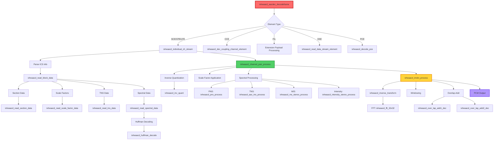
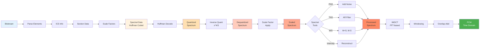

# Core AAC Decoder Function Call Tree

## Mermaid Diagram - Complete Call Tree

```mermaid
graph TD
    %% Main Entry Point
    START[ixheaacd_aacdec_decodeframe] --> ELEM_LOOP{Element Loop}
    
    %% Element Type Branching
    ELEM_LOOP --> SCE[ID_SCE: Single Channel]
    ELEM_LOOP --> CPE[ID_CPE: Channel Pair]
    ELEM_LOOP --> LFE[ID_LFE: Low Frequency]
    ELEM_LOOP --> CCE[ID_CCE: Coupling Channel]
    ELEM_LOOP --> FIL[ID_FIL: Fill Element]
    ELEM_LOOP --> DSE[ID_DSE: Data Stream]
    ELEM_LOOP --> PCE[ID_PCE: Program Config]
    ELEM_LOOP --> END_ELEM[ID_END: End]
    
    %% Common Window Decision for CPE
    CPE --> CW_CHECK{Common Window?}
    CW_CHECK -->|Yes| ICS_READ1[ixheaacd_ics_read]
    CW_CHECK --> MS_DATA[ixheaacd_read_ms_data]
    
    %% Individual Channel Stream Processing
    SCE --> IND_CH[ixheaacd_individual_ch_stream]
    CPE --> IND_CH
    LFE --> IND_CH
    
    IND_CH --> ICS_CHECK{Common Window?}
    ICS_CHECK -->|No| ICS_READ2[ixheaacd_ics_read]
    ICS_CHECK --> BLOCK_DATA[ixheaacd_read_block_data]
    ICS_READ1 --> BLOCK_DATA
    ICS_READ2 --> BLOCK_DATA
    
    %% ICS Read internals
    ICS_READ1 --> WS_CHECK{Window Sequence}
    ICS_READ2 --> WS_CHECK
    WS_CHECK -->|Long| READ_MAX_SFB_L[Read max_sfb 7 bits]
    WS_CHECK -->|Short| READ_MAX_SFB_S[Read max_sfb + grouping 11 bits]
    WS_CHECK --> LTP_CHECK{LTP Present?}
    LTP_CHECK -->|Yes| LTP_DECODE[ixheaacd_ltp_decode]
    LTP_DECODE --> LTP_DATA[ixheaacd_ltp_data]
    
    %% Block Data Reading - Bitstream Parsing
    BLOCK_DATA --> SECTION[ixheaacd_read_section_data]
    BLOCK_DATA --> SCALE_F[ixheaacd_read_scale_factor_data]
    BLOCK_DATA --> PULSE_CHECK{Pulse Data?}
    PULSE_CHECK -->|Yes| PULSE[ixheaacd_read_pulse_data]
    BLOCK_DATA --> TNS_CHECK{TNS Present?}
    TNS_CHECK -->|Yes| TNS[ixheaacd_read_tns_data]
    BLOCK_DATA --> SPECTRAL[ixheaacd_read_spectral_data]
    
    %% Section Data
    SECTION --> SECT_LOOP[Loop over sections]
    SECT_LOOP --> SECT_LEN[Read section length]
    SECT_LOOP --> SECT_CB[Read codebook]
    
    %% Scale Factor Data
    SCALE_F --> SF_DPCM[DPCM decode scale factors]
    SF_DPCM --> HUFF_SF[Huffman decode differences]
    
    %% TNS Data
    TNS --> TNS_NFILT[Read n_filt]
    TNS --> TNS_COEF_RES[Read coef_res]
    TNS --> TNS_FILTER[Loop filters]
    TNS_FILTER --> TNS_ORDER[Read order]
    TNS_FILTER --> TNS_DIR[Read direction]
    TNS_FILTER --> TNS_COEF[Read coefficients]
    
    %% Spectral Data Reading
    SPECTRAL --> RESIL_CHECK{Resilience Mode?}
    RESIL_CHECK -->|No| STANDARD_HUFF[Standard Huffman]
    RESIL_CHECK -->|Yes| HCR[HCR Mode]
    
    STANDARD_HUFF --> WIN_CHECK{Window Type?}
    WIN_CHECK -->|Long| HUFF_LONG[Huffman decode long]
    WIN_CHECK -->|Short| HUFF_SHORT[Huffman decode short]
    
    HUFF_LONG --> HUFF_DEC2[ixheaacd_huffman_dec_word2]
    HUFF_SHORT --> DECODE_HUFF[ixheaacd_decode_huffman]
    
    HUFF_DEC2 --> HUFF_QUAD2[ixheaacd_huffman_dec_word2_quad]
    HUFF_DEC2 --> HUFF_PAIR2[ixheaacd_huffman_dec_word2_pair]
    HUFF_DEC2 --> HUFF_11[ixheaacd_huffman_dec_word2_11]
    
    DECODE_HUFF --> HUFF_WORD1[ixheaacd_huffman_dec_word1]
    DECODE_HUFF --> HUFF_QUAD[ixheaacd_huffman_dec_quad]
    DECODE_HUFF --> HUFF_PAIR[ixheaacd_huffman_dec_pair]
    
    HUFF_WORD1 --> HUFF_DECODE_CALL1[ixheaacd_huffman_decode]
    HUFF_QUAD --> HUFF_DECODE_CALL2[ixheaacd_huffman_decode]
    HUFF_PAIR --> HUFF_DECODE_CALL3[ixheaacd_huffman_decode]
    
    %% HCR Mode
    HCR --> HCR_INIT[ixheaacd_huff_code_reorder_init]
    HCR --> HCR_DEC[ixheaacd_hcr_decoder]
    HCR_DEC --> HCR_MUTE[ixheaacd_huff_mute_erroneous_lines]
    
    %% Scale Factor Application
    SPECTRAL --> SF_PROCESS[ixheaacd_scale_factor_process_dec]
    SF_PROCESS --> SINGLE_SCF[ixheaacd_process_single_scf]
    SINGLE_SCF --> SCALE_VAL["Apply scale: value *= 2^(sf/4)"]
    
    %% Channel Pair Processing
    IND_CH --> CHAN_PAIR[ixheaacd_channel_pair_process]
    
    CHAN_PAIR --> RESIL_INV_Q{Resilience Mode?}
    RESIL_INV_Q -->|Yes| INV_QUANT_BLOCK[ixheaacd_cblock_inv_quant_spect_data]
    RESIL_INV_Q --> SCALE_SPECT[ixheaacd_cblock_scale_spect_data]
    
    INV_QUANT_BLOCK --> INV_Q_LOOP[Loop windows/groups/bands]
    INV_Q_LOOP --> INV_Q_CHECK{"|x| > 127"?}
    INV_Q_CHECK -->|Yes| INV_Q_FUNC[ixheaacd_inv_quant]
    INV_Q_CHECK -->|No| INV_Q_TABLE[Lookup pow_table_Q13]
    INV_Q_FUNC --> POW_CALC["x^(4/3) calculation"]
    
    SCALE_SPECT --> SF_PROC2[ixheaacd_scale_factor_process_dec]
    
    %% Stereo Processing
    CHAN_PAIR --> STEREO_CHECK{Channel Pair?}
    STEREO_CHECK -->|Yes| PNS_MS_CHECK{PNS Active?}
    PNS_MS_CHECK -->|Yes| MAP_MS_PNS[ixheaacd_map_ms_mask_pns]
    MAP_MS_PNS --> SET_CORR[ixheaacd_set_corr_info]
    
    STEREO_CHECK --> MS_STEREO[ixheaacd_ms_stereo_process]
    MS_STEREO --> MS_APPLY["Apply M/S: L=M+S, R=M-S"]
    
    STEREO_CHECK --> INT_STEREO[ixheaacd_intensity_stereo_process]
    INT_STEREO --> INT_RECON[Reconstruct from intensity]
    
    %% PNS Processing
    CHAN_PAIR --> PNS_PROC[ixheaacd_pns_process]
    PNS_PROC --> PNS_GEN[Generate noise]
    PNS_PROC --> PNS_SCALE[Scale by energy]
    
    %% LTP Processing
    CHAN_PAIR --> LTP_PROC_CHECK{LTP Mode?}
    LTP_PROC_CHECK -->|Yes| LT_PRED[ixheaacd_lt_prediction]
    LT_PRED --> LT_RECON[Long-term prediction reconstruction]
    
    %% TNS Processing  
    CHAN_PAIR --> TNS_PROC_CHECK{TNS Present?}
    TNS_PROC_CHECK -->|Yes| AAC_TNS[ixheaacd_aac_tns_process]
    AAC_TNS --> TNS_AR_FILT[Apply AR filter per window]
    TNS_AR_FILT --> TNS_COEF_APPLY[Filter spectral coefficients]
    
    %% IMDCT Processing
    CHAN_PAIR --> IMDCT_PROC[ixheaacd_imdct_process]
    
    IMDCT_PROC --> IMDCT_WIN_CHECK{Window Sequence?}
    IMDCT_WIN_CHECK -->|Long| IMDCT_LONG[Long window IMDCT]
    IMDCT_WIN_CHECK -->|Short| IMDCT_SHORT[Short window IMDCT]
    IMDCT_WIN_CHECK -->|Transition| IMDCT_TRANS[Transition IMDCT]
    
    IMDCT_LONG --> INV_TRANSFORM[ixheaacd_inverse_transform]
    IMDCT_SHORT --> INV_TRANSFORM
    IMDCT_TRANS --> INV_TRANSFORM
    
    INV_TRANSFORM --> PRE_TWIDDLE[Pre-twiddle computation]
    INV_TRANSFORM --> FFT_CALL[FFT N/4-point]
    INV_TRANSFORM --> POST_TWIDDLE[Post-twiddle computation]
    
    FFT_CALL --> FFT_32[ixheaacd_fft_32x32]
    FFT_CALL --> RADIX4[Radix-4 butterflies]
    
    %% Windowing and Overlap-Add
    IMDCT_PROC --> WINDOWING[Apply window function]
    WINDOWING --> WIN_TYPE{Window Type?}
    WIN_TYPE -->|Sine| SINE_WIN[Sine window]
    WIN_TYPE -->|KBD| KBD_WIN[KBD window]
    WIN_TYPE -->|Low Overlap| LOW_WIN[Low overlap ELD]
    
    IMDCT_PROC --> OLA_CHECK{Overlap-Add Type?}
    OLA_CHECK -->|Type 1| OLA1[ixheaacd_over_lap_add1_dec]
    OLA_CHECK -->|Type 2| OLA2[ixheaacd_over_lap_add2_dec]
    OLA_CHECK -->|480/512| LAP1[ixheaacd_lap1_512_480]
    
    OLA1 --> OLA_CALC1[out = curr*win + prev*win]
    OLA2 --> OLA_CALC2[out = curr + prev*win]
    LAP1 --> OLA_CALC3[Special 480/512 overlap]
    
    IMDCT_PROC --> COPY_OUT[ixheaacd_dec_copy_outsample]
    COPY_OUT --> UPDATE_OVERLAP[Store overlap buffer]
    
    %% LTP Update
    IMDCT_PROC --> LTP_UPDATE_CHECK{LTP Mode?}
    LTP_UPDATE_CHECK -->|Yes| LT_UPDATE[ixheaacd_lt_update_state]
    LT_UPDATE --> LTP_BUF_UPDATE[Update LTP buffer]
    
    %% DRC Processing
    CHAN_PAIR --> DRC_CHECK{DRC Enabled?}
    DRC_CHECK -->|Yes| DRC_APPLY[ixheaacd_drc_apply]
    DRC_APPLY --> DRC_GAIN[Apply gain curves]
    
    %% Error Concealment
    CHAN_PAIR --> EC_CHECK{Frame Bad?}
    EC_CHECK -->|Yes| AAC_EC[ixheaacd_aac_apply_ec]
    AAC_EC --> EC_FADE[Apply fade factor]
    AAC_EC --> EC_COPY[Copy previous spectrum]
    
    %% Output
    IMDCT_PROC --> PCM_OUT[PCM Time-domain Output]
    
    %% Coupling Channel Processing
    CCE --> DEC_CCE[ixheaacd_dec_coupling_channel_element]
    DEC_CCE --> CCE_ICS[Parse ICS info]
    DEC_CCE --> CCE_DATA[Parse coupling data]
    DEC_CCE --> CCE_APPLY[Apply coupling]
    
    %% Fill Element - Extension Payload
    FIL --> CHECK_SBR[ixheaacd_check_for_sbr_payload]
    CHECK_SBR --> EXT_TYPE{Extension Type}
    EXT_TYPE --> SBR_DATA[SBR Data]
    EXT_TYPE --> DRC_DATA[DRC Data]
    EXT_TYPE --> MPS_DATA[MPS Data]
    
    %% Data Stream Element
    DSE --> READ_DSE[ixheaacd_read_data_stream_element]
    READ_DSE --> DSE_ALIGN[Byte align]
    
    %% Program Config Element
    PCE --> DECODE_PCE[ixheaacd_decode_pce]
    DECODE_PCE --> PCE_PARSE[Parse PCE structure]
    
    %% Styling
    classDef entryPoint fill:#ff6b6b,stroke:#c92a2a,stroke-width:3px,color:#fff
    classDef bitstream fill:#4dabf7,stroke:#1971c2,stroke-width:2px,color:#fff
    classDef spectral fill:#51cf66,stroke:#2f9e44,stroke-width:2px,color:#fff
    classDef transfor fill:#ffd43b,stroke:#f08c00,stroke-width:2px,color:#000
    classDef stereo fill:#ff8787,stroke:#fa5252,stroke-width:2px,color:#fff
    classDef output fill:#b197fc,stroke:#7950f2,stroke-width:2px,color:#fff
    
    class START entryPoint
    class SECTION,SCALE_F,PULSE,TNS,SPECTRAL,HUFF_DEC2,DECODE_HUFF bitstream
    class INV_QUANT_BLOCK,SCALE_SPECT,PNS_PROC,TNS_PROC_CHECK spectral
    class IMDCT_PROC,INV_TRANSFORM,FFT_CALL,WINDOWING,OLA1,OLA2 transfor
    class MS_STEREO,INT_STEREO stereo
    class PCM_OUT output
```



## Key Function Categories

### 1. Bitstream Parsing Layer
- `ixheaacd_aacdec_decodeframe` - Main entry point
- `ixheaacd_individual_ch_stream` - Process individual channel stream
- `ixheaacd_ics_read` - Read ICS (Individual Channel Stream) info
- `ixheaacd_read_block_data` - Read block data for channel

### 2. Syntax Element Parsing
- `ixheaacd_read_section_data` - Parse section data (codebooks)
- `ixheaacd_read_scale_factor_data` - Parse scale factors
- `ixheaacd_read_pulse_data` - Parse pulse coding data
- `ixheaacd_read_tns_data` - Parse TNS data
- `ixheaacd_read_ms_data` - Parse M/S stereo mask

### 3. Spectral Data Decoding
- `ixheaacd_read_spectral_data` - Main spectral data decoder
- `ixheaacd_huffman_dec_word2` - Huffman decode (word-based)
- `ixheaacd_decode_huffman` - Huffman decode (standard)
- `ixheaacd_huffman_dec_quad` - Decode quad values
- `ixheaacd_huffman_dec_pair` - Decode pair values
- `ixheaacd_huffman_decode` - Low-level Huffman lookup

### 4. Inverse Quantization
- `ixheaacd_cblock_inv_quant_spect_data` - Block inverse quantization
- `ixheaacd_inv_quant` - Single value inverse quantization (x^4/3)
- `ixheaacd_inverse_quantize` - Inverse quantize array

### 5. Scale Factor Application
- `ixheaacd_scale_factor_process_dec` - Process all scale factors
- `ixheaacd_cblock_scale_spect_data` - Scale spectral data per block
- `ixheaacd_process_single_scf` - Apply single scale factor

### 6. Spectral Processing Tools
- `ixheaacd_pns_process` - Perceptual Noise Substitution
- `ixheaacd_aac_tns_process` - Temporal Noise Shaping
- `ixheaacd_lt_prediction` - Long-Term Prediction
- `ixheaacd_pulse_data_apply` - Apply pulse coding

### 7. Stereo Processing
- `ixheaacd_channel_pair_process` - Main channel pair processor
- `ixheaacd_ms_stereo_process` - M/S stereo processing
- `ixheaacd_intensity_stereo_process` - Intensity stereo
- `ixheaacd_map_ms_mask_pns` - Map M/S mask with PNS
- `ixheaacd_set_corr_info` - Set correlation info

### 8. IMDCT and Windowing
- `ixheaacd_imdct_process` - Main IMDCT processor
- `ixheaacd_inverse_transform` - Core IMDCT transform
- `ixheaacd_fft_32x32` - FFT implementation
- `ixheaacd_over_lap_add1_dec` - Overlap-add type 1
- `ixheaacd_over_lap_add2_dec` - Overlap-add type 2
- `ixheaacd_lap1_512_480` - Special overlap for 480/512
- `ixheaacd_dec_copy_outsample` - Copy output samples

### 9. LTP (Long-Term Prediction)
- `ixheaacd_ltp_decode` - Decode LTP data
- `ixheaacd_ltp_data` - Parse LTP parameters
- `ixheaacd_lt_update_state` - Update LTP state buffer
- `ixheaacd_init_ltp_object` - Initialize LTP structure

### 10. Error Resilience
- `ixheaacd_huff_code_reorder_init` - Initialize HCR
- `ixheaacd_hcr_decoder` - HCR decoder
- `ixheaacd_huff_mute_erroneous_lines` - Mute errors

### 11. Error Concealment
- `ixheaacd_aac_apply_ec` - Apply error concealment
- `ixheaacd_aac_ec_init` - Initialize EC state

### 12. Other Elements
- `ixheaacd_dec_coupling_channel_element` - Coupling channel
- `ixheaacd_check_for_sbr_payload` - Check for SBR data
- `ixheaacd_read_data_stream_element` - DSE parsing
- `ixheaacd_decode_pce` - Program Config Element


## Simplified High-Level View



## Critical Path Analysis

### Hot Path Functions (Most CPU Time)

1. **Huffman Decoding (~15-20%)**
   ```
   ixheaacd_read_spectral_data
   └── ixheaacd_huffman_dec_word2 / ixheaacd_decode_huffman
       ├── ixheaacd_huffman_dec_quad
       ├── ixheaacd_huffman_dec_pair  
       └── ixheaacd_huffman_decode (table lookup)
   ```

2. **Inverse Quantization (~10-15%)**
   ```
   ixheaacd_cblock_inv_quant_spect_data
   └── ixheaacd_inv_quant
       └── pow_table_Q13[] or calculation for |x| > 127
   ```

3. **IMDCT (~20-30%)**
   ```
   ixheaacd_imdct_process
   └── ixheaacd_inverse_transform
       ├── Pre-twiddle
       ├── ixheaacd_fft_32x32 (FFT N/4)
       └── Post-twiddle
   ```

4. **Overlap-Add (~5-10%)**
   ```
   ixheaacd_imdct_process
   └── ixheaacd_over_lap_add1_dec / ixheaacd_over_lap_add2_dec
       └── Window multiplication + accumulation
   ```

5. **Scale Factor Application (~5-10%)**
   ```
   ixheaacd_scale_factor_process_dec
   └── ixheaacd_process_single_scf
       └── Multiply spectrum by 2^(sf/4)
   ```

## Data Flow Through Core AAC Decoder



## Function Call Depth Analysis

### Maximum Call Depth: ~8 levels

```
Level 0: ixheaacd_aacdec_decodeframe (Entry)
│
Level 1: ├─ ixheaacd_individual_ch_stream
│        └─ ixheaacd_channel_pair_process
│
Level 2:    ├─ ixheaacd_ics_read
│           ├─ ixheaacd_read_block_data
│           └─ ixheaacd_imdct_process
│
Level 3:       ├─ ixheaacd_read_section_data
│              ├─ ixheaacd_read_scale_factor_data
│              ├─ ixheaacd_read_tns_data
│              ├─ ixheaacd_read_spectral_data
│              ├─ ixheaacd_inverse_transform
│              └─ ixheaacd_over_lap_add1_dec
│
Level 4:          ├─ ixheaacd_huffman_dec_word2
│                 ├─ ixheaacd_decode_huffman
│                 └─ ixheaacd_fft_32x32
│
Level 5:             ├─ ixheaacd_huffman_dec_quad
│                    ├─ ixheaacd_huffman_dec_pair
│                    └─ Radix-4 butterfly stages
│
Level 6:                └─ ixheaacd_huffman_decode (table lookup)
│
Level 7:                   └─ Table access
```

## Function Categorization by Execution Frequency

### Per-Frame Functions (Execute once per frame)
- `ixheaacd_aacdec_decodeframe`
- `ixheaacd_check_for_sbr_payload`
- DRC and error concealment functions

### Per-Element Functions (Execute per channel element)
- `ixheaacd_individual_ch_stream`
- `ixheaacd_channel_pair_process`
- `ixheaacd_ics_read`
- `ixheaacd_read_block_data`

### Per-Channel Functions (Execute per audio channel)
- `ixheaacd_imdct_process`
- `ixheaacd_inverse_transform`
- `ixheaacd_over_lap_add1_dec`
- `ixheaacd_aac_tns_process`

### Per-Window Functions (8x for short windows)
- IMDCT per window group
- TNS filter application
- Windowing and overlap-add

### Per-Sample/Per-Coefficient Functions (Hot loops)
- `ixheaacd_huffman_decode` (per coefficient)
- `ixheaacd_inv_quant` (per coefficient)
- Scale factor application (per coefficient)
- Window multiplication (per sample)
- Overlap-add accumulation (per sample)

## Key Optimization Points for Rust

### 1. Huffman Decoding
**Current C approach:**
- Manual bit manipulation
- Table lookups with pointer arithmetic
- Branching based on codebook type

**Rust improvements:**
- Type-safe bitstream reader with bounds checking
- Const generic Huffman tables
- Match expressions for codebook dispatch
- SIMD for parallel coefficient decode (if possible)

```rust
pub fn huffman_decode<const N: usize>(
    reader: &mut BitReader,
    table: &HuffmanTable<N>
) -> Result<QuantPair, DecodeError>
```

### 2. Inverse Quantization
**Current C approach:**
- Lookup table for |x| < 128
- Function call for larger values
- Fixed-point or floating-point depending on config

**Rust improvements:**
- Generic over sample type (i16/i32/f32)
- Const table for fast path
- SIMD for batch processing
- Inline assembly for x^(4/3) if needed

```rust
#[inline(always)]
pub fn inv_quant<T: Sample>(x: i16) -> T {
    if x.abs() < 128 {
        POW_TABLE_Q13[x.abs() as usize] * x.signum()
    } else {
        // Optimized pow calculation
    }
}
```

### 3. IMDCT/FFT
**Current C approach:**
- Platform-specific assembly (ARM/x86)
- Manual SIMD intrinsics
- Fixed-size implementations

**Rust improvements:**
- Use rustfft or custom SIMD implementation
- Portable SIMD (std::simd)
- Const generic sizes
- Zero-cost abstractions

```rust
pub trait Imdct<const N: usize> {
    fn transform(&mut self, input: &[f32; N], output: &mut [f32; N*2]);
}
```

### 4. Spectral Processing
**Current C approach:**
- In-place array modifications
- Manual loop unrolling
- Fixed-point arithmetic

**Rust improvements:**
- Iterator-based processing
- Trait-based filters
- Type-safe coefficient access
- Automatic vectorization

```rust
spectrum.iter_mut()
    .zip(scale_factors.iter())
    .for_each(|(coeff, sf)| *coeff *= sf.to_linear());
```

## Memory Access Patterns

### Sequential Access (Cache-Friendly)
- Spectral data reading/writing
- Scale factor application
- Overlap-add buffer operations
- Output sample writing

### Random Access (Cache-Unfriendly)
- Huffman table lookups
- Quantization table lookups
- Section data parsing (scattered codebooks)

### Optimization Strategy
1. **Prefetching**: Use compiler hints for table lookups
2. **Alignment**: Align spectral buffers to SIMD boundaries
3. **Locality**: Keep hot data in same cache lines
4. **Streaming**: Use streaming stores for output

